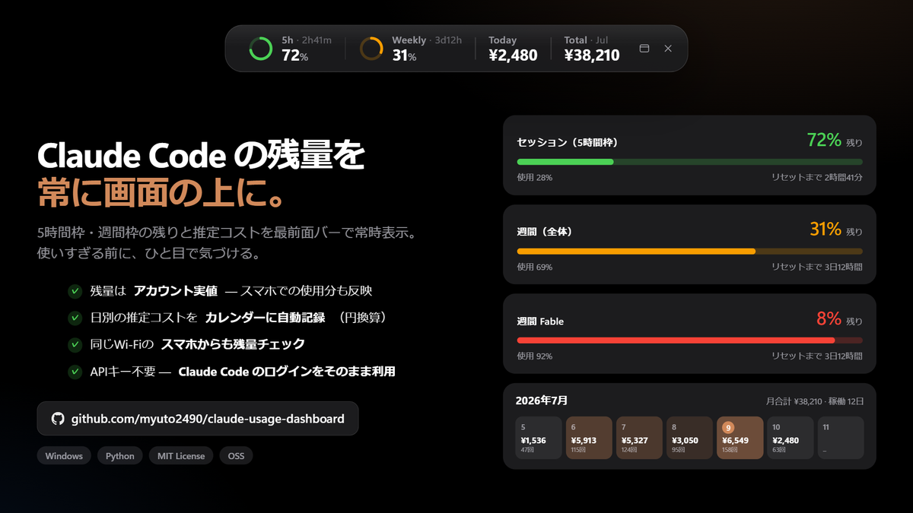

# Claude Usage Dashboard

[](https://github.com/myuto2490/claude-usage-dashboard/releases)
[](LICENSE)


Claude Code の使用量・推定コスト・残量（5時間枠/週間枠）を Windows で常時可視化する非公式ダッシュボード。

> An unofficial Windows dashboard that visualizes your Claude Code token usage, estimated cost, and subscription rate limits (5-hour / weekly) — with an always-on-top mini bar. UI is in Japanese.



ローカルに保存された Claude Code のログ（`~/.claude`）を読み取り、Anthropic の利用状況 API から**アカウント全体の残量の実値**を取得して 1 画面に表示します。追加の API キーは不要で、Python 標準ライブラリだけで動作します。

---

## 主な機能

| 機能 | 説明 |
| --- | --- |
| **常時表示バー** | 画面上辺に最前面で常駐する細いバー。5時間枠/週間枠の残量（アクティビティリング）と今日/今月の推定コスト（円）を表示。他のウィンドウを開いていても隠れません |
| **ダッシュボード** | 利用上限ゲージ・モデル別/プロジェクト別集計・時間帯ヒートマップ・Claude Code バージョン別などの詳細画面。✕で閉じてもバーは残り、バーの ▭ でいつでも再表示 |
| **カレンダー** | 日別の推定コスト（円換算）・呼び出し回数・トークン数を月グリッドで表示。履歴は `~/.ai_usage_dashboard/history.json` に永続化され、Claude のログが消えても残ります |
| **スマホ表示** | 同じ Wi-Fi のスマホ/他PCから `http://<PCのIP>:8787/status` で残量を確認可能 |
| **残量はアカウント実値** | 残量は Anthropic の利用状況 API から取得するため、スマホの Claude アプリや他 PC での使用分も正確に反映されます |
| **トークン自動更新** | OAuth アクセストークンを自動リフレッシュ。この PC で Claude Code を長期間使わなくても残量取得が止まりません |
| **多重起動防止** | 何度ダブルクリックしても 1 つだけ起動。2つ目は既存ウィンドウを前面に出して終了します |

> [!WARNING]
> **非公式ツールです。** Anthropic とは無関係で、残量取得とトークン更新に文書化されていない内部 API を利用しているため、予告なく動作しなくなる可能性があります。コストは公開単価に基づく**推定値**であり、サブスクリプション利用では実際の請求は発生しません（参考値です）。

## 動作要件

- **Windows 10 / 11**
- **Python 3.11 以上**（単体 exe をビルドすれば実行時は不要）
- **Claude Code** がインストール済みで、**Pro / Max サブスクリプションでログイン済み**であること

## 初期設定（Claude との接続）

このアプリに API キーの設定は不要です。**Claude Code のログイン情報をそのまま利用**します。

### 1. Claude Code をセットアップ

まだの場合は [Claude Code](https://claude.com/claude-code) をインストールし、ログインします:

```bat
npm install -g @anthropic-ai/claude-code
claude
```

初回起動時にブラウザが開くので、**Pro / Max サブスクリプションのアカウント**でログインしてください。
ログインが完了すると、以下のファイルが自動的に作られます。本アプリはこれらを読み取るだけです:

| パス | 内容 | 用途 |
| --- | --- | --- |
| `~/.claude/projects/**/*.jsonl` | 会話ログ（モデル・トークン数など） | 使用量・コストの集計 |
| `~/.claude/.credentials.json` | OAuth トークン | 残量（5時間/週間）の取得 |

### 2. 本アプリを起動

```bat
git clone https://github.com/myuto2490/claude-usage-dashboard.git
cd claude-usage-dashboard
pip install -r requirements.txt   # 任意 (ネイティブウィンドウ表示用の pywebview)
py ai_usage_dashboard.py
```

または同梱の `AI使用状況ダッシュボード.bat` をダブルクリック（コンソール窓なしで起動）。

`pywebview` が無い場合も Edge/Chrome のアプリモードに自動フォールバックして動作しますが、
その場合は常時表示バーは表示されません。**pywebview の導入を推奨します。**

### 3. 単体 exe をビルド（任意）

Python 無しで配布・常用したい場合:

```bat
pip install pyinstaller pywebview pillow
py make_icon.py                    # アイコンを作り直す場合のみ (app_icon.ico は同梱済み)
pyinstaller AIUsageDashboard.spec
```

`dist\AI使用状況ダッシュボード.exe` が 1 つだけ生成されます。スタートアップに登録すれば PC 起動時に常駐します。

### うまく動かないとき

| 症状 | 対処 |
| --- | --- |
| 「残量を取得できません (未ログイン)」 | `claude` を起動してログインし直す |
| 残量が「レート制限 (429)」になる | しばらく待つと自動回復します（取得は約60秒間隔に制限済み） |
| ポート 8787 が使えない | 環境変数 `AI_USAGE_PORT` で変更 |
| スマホから `/status` が開けない | Windows ファイアウォールで本アプリ (python/exe) の受信を許可。同じネットワークにいるか確認 |

## 使い方

- **バー**: ドラッグで移動。▭ ボタンでダッシュボードを開く。✕ ボタンは**2度押しで終了**（1度目で赤く点滅）
- **ダッシュボード**: ヘッダーの「非表示にする」またはウィンドウの ✕ で本体だけ閉じられます（バーは残る）
- **カレンダー**: ‹ › で月移動。セルにカーソルを乗せると詳細（USD・為替レート・トークン数）
- **スマホ**: ダッシュボードに表示される `http://<PCのIP>:8787/status` を開く。ホーム画面に追加するとアプリのように使えます

## データとプライバシー

配布物・リポジトリに個人データは含まれません。実行時にアクセスするのは以下だけです:

### 読み取り

- `~/.claude/projects/**/*.jsonl` — 使用量の集計（内容はローカルで処理され、外部送信されません）
- `~/.claude/.credentials.json` — 残量取得・トークン更新用

### 書き込み

- `~/.ai_usage_dashboard/history.json` — 日別履歴（円換算）
- `~/.ai_usage_dashboard/usdjpy.json` — 為替レートのキャッシュ
- `~/.claude/.credentials.json` — トークン自動更新時に Claude Code と同じ形式で書き戻し

### 外部通信

- `api.anthropic.com` — 残量の取得と OAuth トークンの更新（自分のアカウントに対してのみ）
- 為替レート API（`open.er-api.com` ほか、1日1回）— USD/JPY の取得のみ

### ネットワーク公開

- 既定でポート 8787 を LAN に公開します（スマホから `/status` を見るため）。
  閲覧のみで、ウィンドウ操作系の API はこの PC (loopback) からしか受け付けません。
  LAN 公開が不要なら `AI_USAGE_LOCAL_ONLY=1` で 127.0.0.1 のみに制限できます

## 環境変数

| 変数 | 既定値 | 説明 |
| --- | --- | --- |
| `AI_USAGE_PORT` | `8787` | 待ち受けポート |
| `AI_USAGE_LOCAL_ONLY` | – | `1` で LAN 公開を無効化 (127.0.0.1 のみ) |
| `AI_USAGE_NO_OVERLAY` | – | `1` で常時表示バーを出さない |
| `AI_USAGE_OVERLAY_WIDTH` | `640` | バーの初期幅 px（表示後に内容へ自動フィット） |
| `AI_USAGE_OVERLAY_HEIGHT` | `64` | バーの初期高さ px（同上） |
| `AI_USAGE_ON_TOP` | – | `1` で本体ウィンドウも常に最前面 |
| `AI_USAGE_NO_CONFIRM_CLOSE` | – | `1` で（バー無し構成時の）終了確認を無効化 |
| `AI_USAGE_NO_WINDOW` | – | `1` でウィンドウを開かずサーバのみ起動 |
| `AI_USAGE_USDJPY` | `160` | 為替取得失敗時のフォールバック USD/JPY |
| `AI_USAGE_USDJPY_RETRY` | `900` | 為替取得に失敗したときの再試行間隔（秒） |
| `AI_USAGE_WEB_SEARCH_COST` | `10.0` | Web検索の単価（USD / 1000リクエスト） |
| `AI_USAGE_LIMITS_TTL` | `60` | 残量の再取得間隔（秒） |
| `AI_USAGE_CLAUDE_UA` | `claude-code/2.0.1` | 残量取得時の User-Agent |

## 仕組み（概要）

- 集計はすべてローカルで行い、Claude Code が書き出す JSONL の `usage` フィールド
  （入出力・キャッシュ書込 5分/1時間 TTL・キャッシュ読込）を公開単価で金額換算します
- 残量は Anthropic の利用状況エンドポイントから取得する**アカウント全体の実値**です
  （429 回避のため約60秒間隔でキャッシュ）
- アクセストークン（約8時間で失効）は期限前に自動でリフレッシュし、
  ローテーションされたリフレッシュトークンを原子的に書き戻します
- UI はローカル HTTP サーバ + WebView2（pywebview）。フレームワーク・外部 CDN 不使用

## バージョン管理

[セマンティックバージョニング](https://semver.org/lang/ja/)（`vメジャー.マイナー.パッチ`）で管理し、
[Releases](https://github.com/myuto2490/claude-usage-dashboard/releases) にタグを切って公開します。
現在のバージョンはダッシュボードのヘッダーに `vX.Y.Z` として表示されます
（ソースでは `ai_usage_dashboard.py` の `APP_VERSION`）。

## ライセンス

[MIT](LICENSE)

Claude および Claude Code は Anthropic PBC の製品です。本プロジェクトは Anthropic とは無関係の非公式ツールです。
